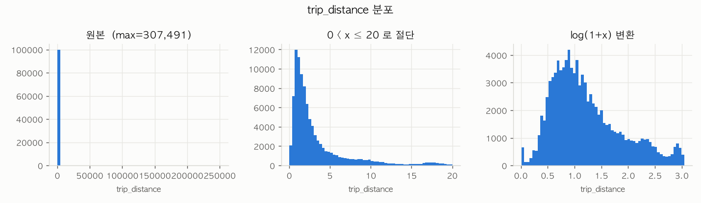
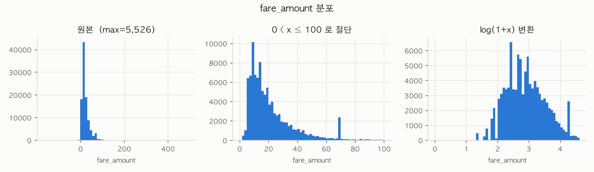
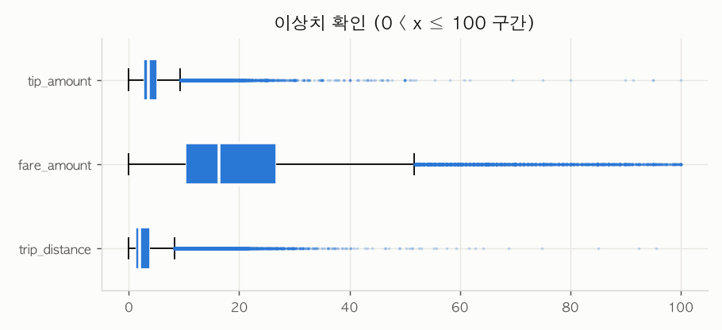
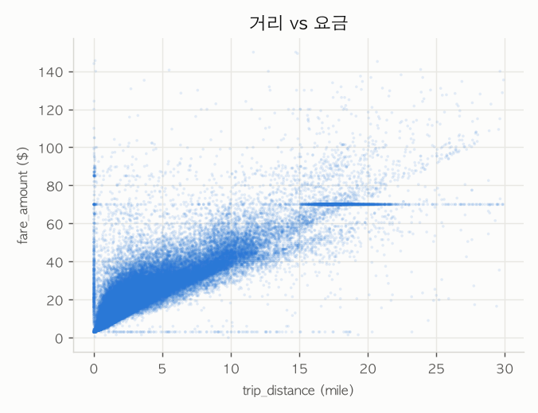
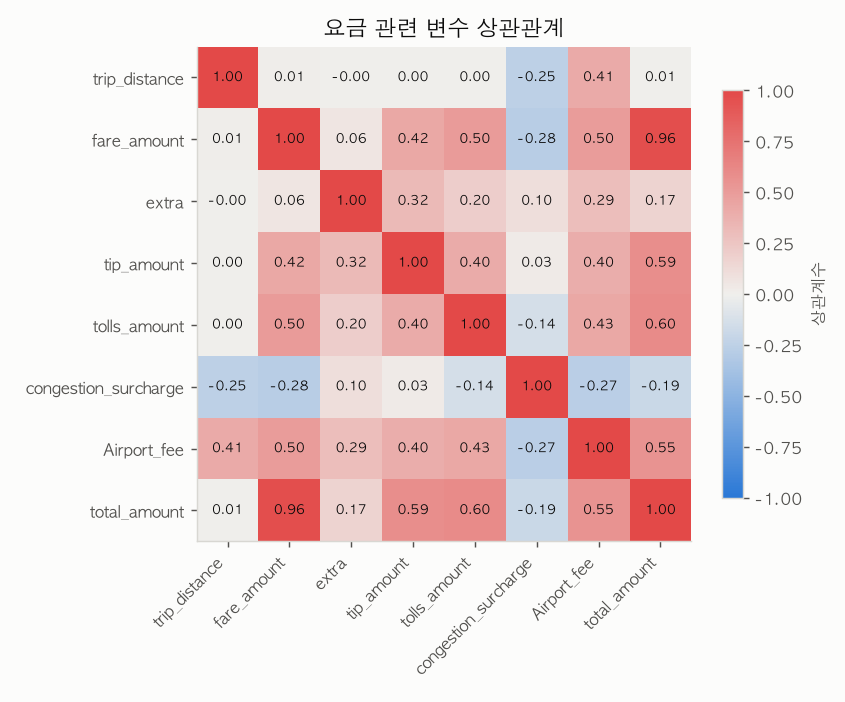

# 2. 시각화 — 분포 · 이상치 · 결측 · 상관관계

> **언제 읽나:** 왜 그렇게 판단했는지 눈으로 확인할 때, 이상치 절단선을 정할 때.

목적: 숫자로 안 보이는 **모양**을 확인한다. `1_구조·통계.md`에서 좁힌 컬럼만 그린다.
생성 스크립트: `../viz.py` · 시각화는 10만 행 샘플, 상관계수는 전체

## 1. 분포 — 히스토그램




원본 / 절단 / 로그 변환 3단 비교.

| 관찰 | 해석 |
|---|---|
| **원본은 막대 하나만 보임** | 최대값 307,491 하나 때문에 x축이 늘어나 나머지가 뭉갬. 이상치 처리 없이는 분포를 볼 수 없다 |
| 절단 후: 왼쪽에 몰린 긴 꼬리 | skew 386의 실제 모양. 짧은 거리 운행이 압도적 |
| **로그 변환 후 종 모양에 근접** | 로그 변환이 유효하다는 증거 → 섹션 4 |
| fare 히스토그램에 **막대 하나가 튐 (약 70달러)** | 자연스러운 분포가 아님 → 아래 4번에서 규명 |

## 2. 이상치 — 박스플롯



0 < x ≤ 100 로 이미 절단했는데도 수염 밖 점이 오른쪽 끝까지 이어진다.

| 컬럼 | 몸통(IQR) | 판정 |
|---|---|---|
| trip_distance | 약 1~4 마일 | 8마일 넘으면 이미 이상치 취급 |
| fare_amount | 약 10~27 달러 | 52달러 이상 다수 |
| tip_amount | 약 0~4 달러 | 0에 몰림 (현금 결제는 팁 기록 안 됨) |

> **주의:** IQR 기준 "이상치"가 곧 "잘못된 값"은 아니다. 공항 장거리 운행은 정상인데 통계적으로는 이상치로 잡힌다. **제거 기준은 통계가 아니라 도메인이 정한다.**

## 3. 결측 패턴 — missingno


시간순 정렬 후에도 흰 줄(결측)이 **전 구간에 고르게 흩어져 있다.**

- 특정 날짜에 시스템이 고장난 게 아니다 → 시간 문제 아님
- 5개 컬럼의 흰 줄 위치가 **완전히 동일** → `1_구조·통계.md`에서 확인한 "동시 결측"의 시각적 확인
- 결론: **수집 경로(사업자)의 차이**가 원인. `1_구조·통계.md §1-3`의 판단을 뒷받침한다

## 4. 관계 — 산점도



우상향 곡선이 보이지만, **직선 3개가 함께 나타난다.**

| 패턴 | 정체 |
|---|---|
| 대각선 밴드 | 정상 — 거리에 비례해 요금 상승 |
| **x=0 수직선** | 거리 0인데 요금 발생 — 취소/오류 (11만 건) |
| **y≈70 수평선** | 거리와 무관하게 70달러 정액 |
| y≈3 수평선 | 기본요금만 부과된 건 |

**y≈70 정액 요금의 정체를 확인했다:**
```
fare_amount 69~70달러  →  97,776건
RatecodeID=2 (JFK 공항 정액제) 중 98.7%가 이 값
```
→ **오류가 아니라 JFK 공항 정액 요금제.** 이상치로 지우면 안 되고, `RatecodeID`로 구분해야 한다.

## 5. 상관관계 — 히트맵



**이 단계 최대의 발견:**

| | 상관계수 |
|---|---|
| 원본 trip_distance ↔ fare_amount | **0.008** |
| 이상치 절단 후 (거리≤100, 요금≤500) | **0.866** |

거리와 요금은 당연히 강한 상관인데, **원본에서는 0에 가깝게 나온다.** 307,491마일짜리 값 하나가 상관계수 전체를 무너뜨린 것이다.

> **이것이 "품질 확인을 관계 탐색보다 먼저 해야 하는" 이유다.** 원본 corr만 보고 "거리는 요금과 무관하니 빼자"고 판단했다면 가장 중요한 변수를 버릴 뻔했다. 숫자는 멀쩡히 출력되지만 조용히 틀린다.

**그 외:**

| 쌍 | 상관 | 의미 |
|---|---|---|
| total_amount ↔ fare_amount | **0.96** | total은 fare의 합계 성분 → **둘 다 넣으면 다중공선성/누수** |
| total_amount ↔ tolls, tip | 0.60, 0.59 | 역시 합계 구성 요소 |
| congestion_surcharge ↔ 전반 | 음수 | 정액이라 고액 운행에서 상대 비중 하락 |

## 판단

1. **이상치 절단 후 재분석이 필수** — 원본 통계는 신뢰할 수 없다
2. **로그 변환 확정** — 거리·요금 모두 변환 후 종 모양
3. **y=70 정액 건은 보존** — 오류가 아닌 JFK 요금제. `RatecodeID` 플래그로 구분
4. **거리 0 (11만 건)은 별도 취급** — 취소 건일 가능성
5. **`total_amount`는 타겟으로만 쓰거나 피처에서 제외** — 다른 요금 컬럼과 중복

## Findings → 다음 섹션

| 발견 | 액션 | 섹션 |
|---|---|---|
| 극단값이 상관계수를 파괴 (0.008 → 0.866) | 이상치 제거 후 분석 | 3 Outlier |
| 거리 0 = 11만 건 | 제거 또는 취소 플래그 | 3 Outlier |
| 로그 변환 시 정규분포 근접 | log1p 적용 | 4 Transformation |
| JFK 정액 70달러 = 9.8만 건 | 이상치 아님, 플래그 생성 | 5 Feature Creation |
| total_amount ↔ fare_amount 0.96 | 변수 선택 (하나만) | 3 |
| 결측이 시간 무관, 사업자별 | 결측 플래그 컬럼 | 3 Missing Value |
