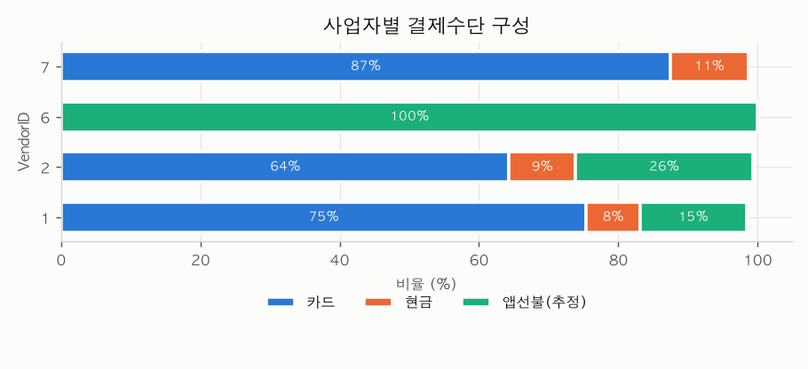
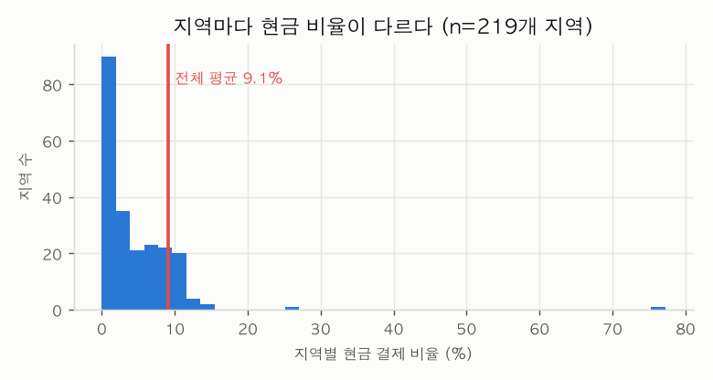

# 3. Target 관계 분석 — payment_type

> **언제 읽나:** 어떤 변수를 만들고 어떤 변수를 버릴지 정할 때, 모델 평가 방식을 정할 때.

질문: **무엇이 결제수단을 가르는가?**
Target이 범주형이므로 ① 그룹별 수치형 분포 차이, ② 범주별 Target 비율 두 가지를 본다.
누수 변수(`tip_amount`, `total_amount`)는 제외하고 분석.

---

## 1. 결제수단별 요금·거리 분포


| 결제수단 | 요금 중앙값 | 거리 중앙값 |
|---|---|---|
| 카드 | $14.2 | 1.72 mile |
| 현금 | $13.5 | 1.52 mile |
| 앱선불(추정) | **$23.2** | **2.63 mile** |

**판정**

| 비교 | 결과 |
|---|---|
| 카드 vs 현금 | **상자가 거의 겹침** → 요금·거리로는 구분 불가. 약한 변수 |
| 앱선불 vs 나머지 | 상자가 뚜렷이 오른쪽 → **구분력 있음** |

> 중앙값 차이($14.2 vs $13.5)만 보면 "차이가 있다"고 판단하기 쉽지만, 분포를 그려보면 거의 포개진다. **중앙값이 다르다 ≠ 구분할 수 있다.**

---

## 2. 사업자별 결제수단 구성



| VendorID | 카드 | 현금 | 앱선불 | 건수 |
|---|---|---|---|---|
| 1 | 75.4% | 7.7% | 15.3% | 805,221 |
| 2 | 64.3% | 9.5% | **25.6%** | 3,226,222 |
| 6 | 0% | 0% | **100%** | 7,643 |
| 7 | 87.4% | 11.3% | **0%** | 51,750 |

**판정: 강력한 변수**

- Vendor 6 → 100% 앱선불, Vendor 7 → 앱선불 0%. **사업자만 알아도 앱선불 여부가 거의 결정된다**
- 다만 6·7은 합쳐서 1.5%뿐. 주력인 1·2는 카드 64~75%로 구분력이 상대적으로 약함
- 카드 vs 현금 구분에는 기여가 작음 (7.7~11.3% 범위)

### ⚠️ Vendor 6이 100%인 것의 해석

`payment_type=0`의 실체는 **"결제수단을 항목별로 보고하지 않음"** 이다. 그런데 Vendor 6은 원래 항목을 분리 보고하지 않는 사업자다.

```
항목을 안 적는 사업자 → 그래서 항목이 안 적혀 있다
```

**동어반복이다.** 결제 행동을 예측하는 게 아니라 **보고 형식을 예측**하는 것이므로, 모델은 맞히지만 얻은 정보는 없다.

| 판단 | 근거 |
|---|---|
| 누수는 아님 — **변수 유지** | 사업자는 예측 시점에 알 수 있는 정보 (팁 금액과 다름) |
| 실무 영향 작음 | 100%/0%인 Vendor 6·7은 합쳐서 1.5%. 나머지 98.5%는 15~26%로 정상 |
| 조치 | 성능이 사업자에 과도하게 의존하면 **사업자 제외 후 재학습해 비교** |

> 근본 원인은 **Target 정의의 모호함**이다. `payment_type=0`이 실제 결제 방식인지 단순 기록 누락인지 확정되면 이 문제는 사라진다.

---

## 3. 지역별 현금 결제 비율



승차 200건 이상인 219개 지역 기준.

| 항목 | 값 |
|---|---|
| 전체 평균 | 9.1% |
| 최소 ~ 최대 | **0.0% ~ 77.2%** |
| 표준편차 | 6.3%p |

**판정: 유효한 변수**

- 대부분 지역은 0~15%에 몰려 있으나 **꼬리가 길다** — 현금 비율 26%, 77%인 지역이 존재
- 승차 상위 지역 중 **132(JFK 공항) 현금 27.0%** 로 압도적. 반면 79번 지역은 6.0%
- 259개를 그대로 쓸 수 없으므로 **현금 비율 기준으로 구간화하거나 타겟 인코딩**

---

## 4. 시간 패턴 (기존 확인분)

| 구분 | 앱선불 비율 |
|---|---|
| 새벽 4시 | **50.9%** |
| 낮 11~16시 | 16~17% |
| 일요일 | 29.1% |
| 월요일 | 19.4% |

**판정: 유효한 변수** — 시간대·요일 파생변수 생성 가치 있음

---

## 5. 변수 유용성 종합

| 변수 | 카드 vs 현금 | 앱선불 구분 | 조치 |
|---|---|---|---|
| VendorID | 약함 | **매우 강함** | 원핫 인코딩 |
| PULocationID | **강함** (0~77%) | 중간 | 타겟 인코딩 또는 구간화 |
| 시간대·요일 | 미확인 | **강함** | 파생변수 생성 |
| fare_amount / trip_distance | **약함** (분포 겹침) | 중간 | 유지하되 기대 낮춤 |
| tip_amount / total_amount | — | — | **제외 (누수)** |

---

## 6. 이 분석이 말하는 것

**두 과제는 난이도가 전혀 다르다.**

| 과제 | 난이도 | 근거 |
|---|---|---|
| 앱선불 여부 예측 | 쉬움 | 사업자·시간대만으로 상당 부분 설명됨 |
| **카드 vs 현금 예측** | **어려움** | 요금·거리 분포가 겹치고, 사업자별 차이도 7.7~11.3%로 좁음. 지역 변수가 사실상 유일한 강한 신호 |

> 목표를 3분류로 잡으면 모델 정확도는 높게 나오지만, 그 성능은 대부분 "앱선불 맞히기"에서 나온 것이다. 정작 어려운 카드 vs 현금은 못 맞히면서 전체 정확도만 좋아 보일 수 있다.
> → **평가 지표를 전체 정확도가 아니라 클래스별로 봐야 한다.** (강의 p8: "정확도는 높은데 재현율이 낮으면 모델이 활용 가능한가?")

---

## 7. 남은 확인 사항

| 질문 | 확인처 |
|---|---|
| `payment_type=0`의 공식 정의 | NYC TLC 데이터 사전 / 업무 담당자 |
| Target을 2분류(카드/현금)로 할지 3분류로 할지 | 과제 정의자 |
| 현금 77% 지역의 정체 (특수 지역인가) | 지역 코드 매핑 테이블 |
