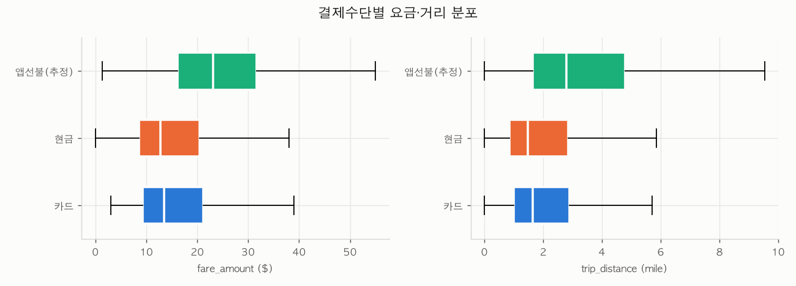
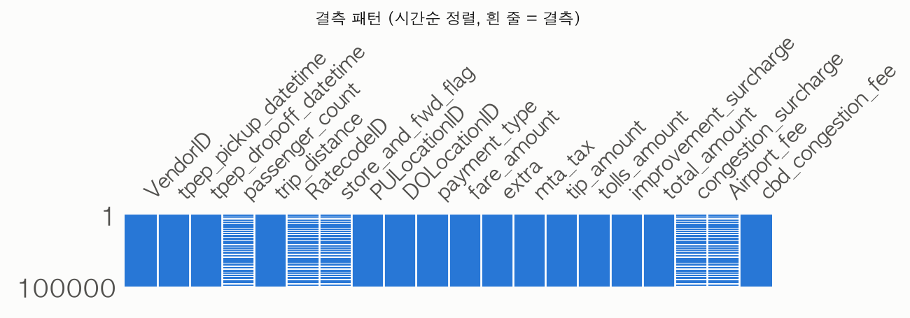

# NYC Yellow Taxi 결제수단 예측 보고서

이 문서는 파이프라인 단계별 결과를 자동으로 모은 팀 내부 기술 보고서입니다.

> 이 파일은 제출용 최종본입니다. 1~5장은 `python -m reporting.generate`가 `reporting/data/*.json`에서 자동 생성한 `report.md`의 내용이고, 6장 결과 해석은 사람이 작성했습니다.

## 1. 실행 및 데이터 정보

> **상태:** 완료

| 항목 | 값 |
|---|---|
| 프로젝트 | team3-end2end/end2end |
| 실행 ID | `pipeline-20260807-1032` |
| 코드 리비전 | `98f16be` |
| 데이터셋 | `eda/yellow_tripdata_2026-05_snappy.parquet` |
| 관측 기간 | 2026-05-01 ~ 2026-05-31 |
| 원본 크기 | 4,090,836행 × 20열 |
| 타깃 | `payment_label` · multiclass_classification |
| 클래스 | 카드, 플렉스 페어, 현금 |

### Pandas vs Polars 로딩 비교

| 라이브러리 | 로딩 시간 | 로딩 결과 크기 |
|---|---:|---:|
| Pandas | 0.22초 | 4,090,836행 × 20열 |
| Polars | 0.10초 | 4,090,836행 × 20열 |

- 두 라이브러리의 로딩 결과 shape 일치 — 같은 데이터를 Polars가 약 2배 빠르게 읽었다 (측정: `eda/data_preparation/data_preparation.ipynb`).

## 2. EDA 결과

> **상태:** 완료

### 데이터 품질

| 수치형 변수 | 범주형 변수 | 결측 셀 | 중복 행 |
|---:|---:|---:|---:|
| 13 | 5 | 4,776,855 | 0 |

### 이상치와 상관관계

- 이상치 수: **622**
- 이상치 규칙: trip_distance < 200, ~(fare_amount >= 100 and trip_distance < 1)
- 높은 상관관계 기준: **|r| ≥ 0.80**

| 변수 A | 변수 B | 상관계수 |
|---|---|---:|
| `trip_distance` | `fare_amount` | 0.8660 |
| `fare_amount` | `total_amount` | 0.9600 |

### 타깃 분포

| 클래스 | 건수 | 비율 |
|---|---:|---:|
| 카드 | 2,660,128 | 68.36% |
| 플렉스 페어 | 878,188 | 22.57% |
| 현금 | 352,939 | 9.07% |

### 컬럼별 결측

| 컬럼 | 결측 수 | 결측률 |
|---|---:|---:|
| `passenger_count` | 955,371 | 23.35% |
| `RatecodeID` | 955,371 | 23.35% |
| `store_and_fwd_flag` | 955,371 | 23.35% |
| `congestion_surcharge` | 955,371 | 23.35% |
| `Airport_fee` | 955,371 | 23.35% |

### 시각화

#### 결제수단별 요금·거리 분포

#### 원본 데이터 결측 패턴

## 3. 전처리 결과

> **상태:** 완료

- 입력: **4,090,836행 × 20열**
- 출력: **3,891,255행 × 12열**
- 데이터 유지율: **95.12%**
- 제거된 행: **199,581**
- 제거된 열: **10**
- 결측치 처리 변수: 없음
- 인코딩 변수: PULocationID, DOLocationID, hour, day_of_week, VendorID, is_airport

### 단계별 필터

| 단계 | 규칙 | 적용 전 | 적용 후 | 제거 |
|---|---|---:|---:|---:|
| 양수 요금 | `fare_amount > 0` | 4,090,836 | 4,073,654 | 17,182 |
| 양수 거리 | `trip_distance > 0` | 4,073,654 | 3,962,811 | 110,843 |
| 거리 극단값 | `trip_distance < 200` | 3,962,811 | 3,962,738 | 73 |
| 요금·거리 불일치 | `~(fare_amount >= 100 and trip_distance < 1)` | 3,962,738 | 3,962,189 | 549 |
| 타깃 클래스 | `payment_type in {0, 1, 2}` | 3,962,189 | 3,942,906 | 19,283 |
| 관측 기간 | `pickup in 2026-05` | 3,942,906 | 3,942,892 | 14 |
| 운행 시간 | `0 < trip_duration < 180` | 3,942,892 | 3,891,255 | 51,637 |

### 피처 구성

- 선택 피처: trip_distance, fare_amount, trip_duration, cbd_congestion_fee, tolls_amount, PULocationID, DOLocationID, hour, day_of_week, VendorID, is_airport
- 제외 피처:
  - `tip_amount`
  - `total_amount`
  - `passenger_count`
  - `RatecodeID`
  - `mta_tax`
  - `improvement_surcharge`
- 파생 피처:
  - `trip_duration`
  - `hour`
  - `day_of_week`
  - `is_airport`
- 변환:
  - `OneHotEncoder` · 컬럼: PULocationID, DOLocationID, hour, day_of_week, VendorID, is_airport · 파라미터: `{'handle_unknown': 'ignore'}`
  - `StandardScaler` · 컬럼: trip_distance, fare_amount, trip_duration, cbd_congestion_fee, tolls_amount · 파라미터: `{}`

## 4. 모델 학습

> **상태:** 완료

### 데이터 분할

| 전략 | 학습 | 검증 | 테스트 | Seed |
|---|---:|---:|---:|---:|
| stratified 80/20 split (튜닝은 train 표본 500,000행으로 3-fold CV) | 3,113,004 | 0 | 778,251 | 42 |

### 모델 정보

| ID | 모델 | 라이브러리 | 학습 시간 | 산출물 |
|---|---|---|---:|---|
| `xgboost` | XGBoost (Optuna 100 trial 중 최적) | xgboost | 2,396.00초 | `outputs/model_xgboost_20260807_1032.joblib` |

> 학습 시간 2,396초는 Optuna 탐색 100회 + 최종 재학습 + 평가를 포함한 전체 파이프라인 실행 시간(09:52~10:32)입니다.

#### 하이퍼파라미터

- `xgboost`: `{'n_estimators': 499, 'learning_rate': 0.2007, 'max_depth': 10, 'subsample': 0.6956, 'colsample_bytree': 0.6686, 'min_child_weight': 3, 'class_weight': 'balanced (sample_weight)'}`

## 5. 평가 결과

> **상태:** 완료

- 평가 모델: **`xgboost`**

### 전체 평가 지표

| Accuracy | Macro Precision | Macro Recall | Macro F1 | Weighted F1 |
|---:|---:|---:|---:|---:|
| 74.282% | 67.731% | 71.155% | 66.876% | 78.018% |

### 교차 검증

- 튜닝 단계에서 3-fold CV를 사용했으며, 선택된 설정의 CV macro F1은 **0.6686** (3-fold 평균, fold별 표준편차는 미기록).
- CV(0.6686) ↔ Test(0.6688) 차이가 0.0002에 불과해 과적합 징후는 없음.

### 클래스별 성능

| 클래스 | Precision | Recall | F1 | Support |
|---|---:|---:|---:|---:|
| 플렉스 페어 | 94.168% | 92.289% | 93.219% | 175,637 |
| 카드 | 89.765% | 71.618% | 79.671% | 532,026 |
| 현금 | 19.258% | 49.558% | 27.737% | 70,588 |

### 혼동행렬

| 실제 ＼ 예측 | 플렉스 페어 | 카드 | 현금 |
|---|---:|---:|---:|
| **플렉스 페어** | 162,093 | 9,469 | 4,075 |
| **카드** | 8,406 | 381,027 | 142,593 |
| **현금** | 1,632 | 33,974 | 34,982 |

## 6. 결과 해석

### 6.1 모델 탐색 결과 비교

Optuna가 100 trial을 세 모델에 나눠 배분하며 탐색한 결과입니다 (CV macro F1 기준).

| 모델 | 탐색 trial 수 | 최고 CV macro F1 |
|---|---:|---:|
| xgboost | 78 | 0.6686 |
| hist_gbm | 11 | 0.6335 |
| logistic | 11 | 0.5028 |

### 6.2 XGBoost (최종 선택 모델)

- 정확도 74.3%가 나왔다. 반면 macro F1은 0.67로 더 낮았다.

  | 클래스 | F1 | 한 줄 평가 |
  |---|---|---|
  | 플렉스 페어 | 0.93 | 거의 완벽하게 구분 |
  | 카드 | 0.80 | 준수함 |
  | 현금 | 0.28 | 사실상 실패 |

- 클래스별 결과를 보면 F1이 낮은 이유를 알 수 있다. 플렉스 페어를 거의 완벽하게 맞추는 대신, 현금은 대부분 예측하지 못한다.
- 결과 상으로, 전체 카드 결제 약 53만 건 중 14만 건을 현금이라고 오판했고 이게 가장 큰 실점 요인이었다.
- 반면, 현금과 플렉스 페어 사이의 혼동은 5,700건으로 비교적 미미했다.
- 즉 **카드와 현금을 구분하지 못한다**는 뜻이다.
- 또한 현금은 전체 9%뿐인 소수 클래스라, 파이프라인이 `USE_CLASS_WEIGHT=True`로 처리했다.
- 그 결과 애매하면 현금이라고 찍는 현상이 발생했고,
  - Recall 0.50: 실제 현금 결제 건 중 절반은 맞혔지만,
  - Precision 0.19: 현금이라고 예측한 것 중 진짜 현금은 19%뿐이었다.
- 즉 모델의 성능 문제라기보다 무엇을 더 중요하게 생각했는지에 대한 trade off로 보는 게 맞다.

### 6.3 HistGradientBoosting

- 점수는 0.6335로, xgboost(0.6686)보다 조금 낮았다.
- 두 모델은 사실 같은 방식으로 공부한다. 스무고개처럼 "거리가 5마일보다 길어? 요금이 20달러 넘어?" 하고 질문을 계속 던지면서 답을 좁혀가는 방식이다.
- 유일한 차이는 **질문의 기준선을 얼마나 꼼꼼하게 고르느냐**다.
  - xgboost: 가능한 기준선을 거의 전부 다 시험해보고 제일 좋은 걸 고른다. → 느리지만 꼼꼼함
  - hist_gbm: 비슷한 값끼리 미리 묶어놓고, 묶음 단위로만 기준선을 고른다. → 빠르지만 대충
  - 예를 들어 키 순서로 반을 나눌 때, xgboost는 1cm 단위로 재서 나누고 hist_gbm은 10cm 단위로 어림잡아 나누는 셈이다.
  - 빨리 끝나는 대신 경계가 살짝 어긋날 수 있고, 그 차이가 점수 차이(0.035)로 나타났다.
- 단, 이 점수가 hist_gbm의 진짜 실력은 아닐 수 있다.
  - Optuna는 100번의 연습 기회를 모델들에게 나눠주는데, 초반에 성적이 좋았던 xgboost에게 78번을 몰아주고 hist_gbm은 11번밖에 못 받았다.
  - 1등을 뽑는 게 목적이면 이 방식이 효율적이지만, "hist_gbm은 원래 이 정도 실력"이라고 말하기엔 연습 기회가 너무 적었다.
  - 공평하게 연습시켰다면 격차는 더 줄었을 수 있다.

### 6.4 Logistic Regression

- 점수는 0.5028로, 트리 모델 둘(0.67 / 0.63)에 한참 못 미쳤다.
- 이 모델은 할 수 있는 게 하나뿐이다. **선 하나를 긋고 "이쪽은 카드, 저쪽은 현금"이라고 나누는 것.**
- 문제는 실제 데이터가 직선으로 안 나뉜다는 것이다.
- 예를 들어 "요금이 이런 구조**이면서** 시간대가 이럴 때만 플렉스 페어" 같은 패턴은 곡선의 경계가 필요하다.
  - 트리 모델: 스무고개 질문을 계속 겹쳐서 구불구불한 경계를 만들 수 있음
  - 로지스틱: 직선 하나가 전부라 이런 패턴을 아예 그릴 수 없음
- 연습 기회가 11번뿐이었던 건 핑계가 안 된다. 이 모델은 조절할 수 있는 것 자체가 거의 없어서, 기회를 더 줬어도 점수는 비슷했을 것이다. 진 이유는 연습 부족이 아니라 몸의 한계다.
- 그래도 쓸모는 있었다. "직선만 긋는 모델은 0.50, 구불구불 긋는 모델은 0.67"이라는 결과 자체가 **이 문제의 답은 단순한 규칙이 아니라 여러 조건의 조합에 숨어있다**는 증거가 됐다. 출발점(베이스라인) 역할은 한 셈이다.

### 6.5 통계 검정 — 카드 vs 현금 (Welch t-test)

수치형 피처 5개에 대해 카드·현금 두 집단의 평균 차이를 Welch t-test로 검정했다 (귀무가설 H0: 두 집단의 평균이 같다). 산출: `data_analysis/outputs/tables/06_ttest_card_vs_cash.csv` (`python data_analysis/feature_analysis.py`).

| feature | 카드 평균 | 현금 평균 | t | p (Welch) | Cohen's d |
|---|---:|---:|---:|---:|---:|
| trip_duration | 18.8945 | 17.1353 | 64.17 | < 0.001 | 0.1064 |
| cbd_congestion_fee | 0.5367 | 0.5061 | 48.91 | < 0.001 | 0.0902 |
| tolls_amount | 0.6051 | 0.5272 | 19.01 | < 0.001 | 0.0341 |
| fare_amount | 20.2502 | 20.3373 | -2.44 | 0.0149 | -0.0048 |
| trip_distance | 3.4344 | 3.4298 | 0.54 | 0.5878 | 0.0010 |

**p-value 해석**:

- trip_duration·cbd_congestion_fee·tolls_amount·fare_amount 4개는 p < 0.05로 귀무가설을 기각한다 — 카드 승객과 현금 승객의 평균이 통계적으로는 다르다.
- 단, 표본이 약 389만 건이면 아주 작은 차이도 유의하게 나오므로 p값만으로 판단해서는 안 된다. 효과크기(Cohen's d)를 함께 보면 가장 큰 trip_duration조차 d = 0.106으로 통상 기준(0.2 미만 = 무시할 수준)에 못 미친다. 즉 **통계적으로 유의하지만 실질적인 차이는 미미하다.**
- trip_distance는 이 표본 크기에서도 p = 0.588로 유의하지 않다 — 카드 승객과 현금 승객의 이동 거리는 사실상 같다.
- 이 결과는 6.2의 모델 진단과 정확히 일치한다: 트립 특성(거리·요금·시간) 피처에는 카드와 현금을 가를 신호가 거의 없으며, 이것이 XGBoost가 카드↔현금을 혼동한 근본 원인이다.

---

_1~5장은 `python -m reporting.generate`로 생성된 `report.md` 기준이며, 6장은 `reports/payment_model_comparison.md`의 해석과 `data_analysis` 통계 검정 결과를 정리한 것입니다._
