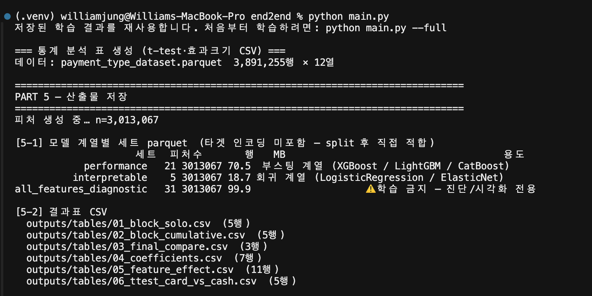
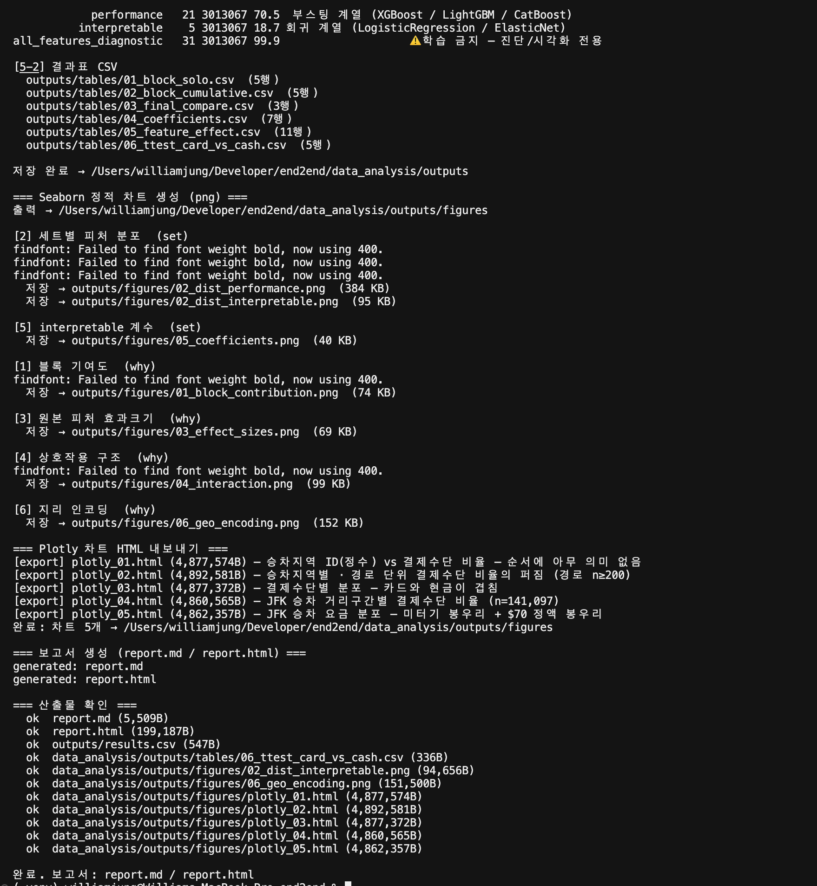
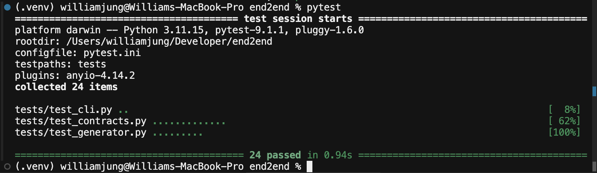
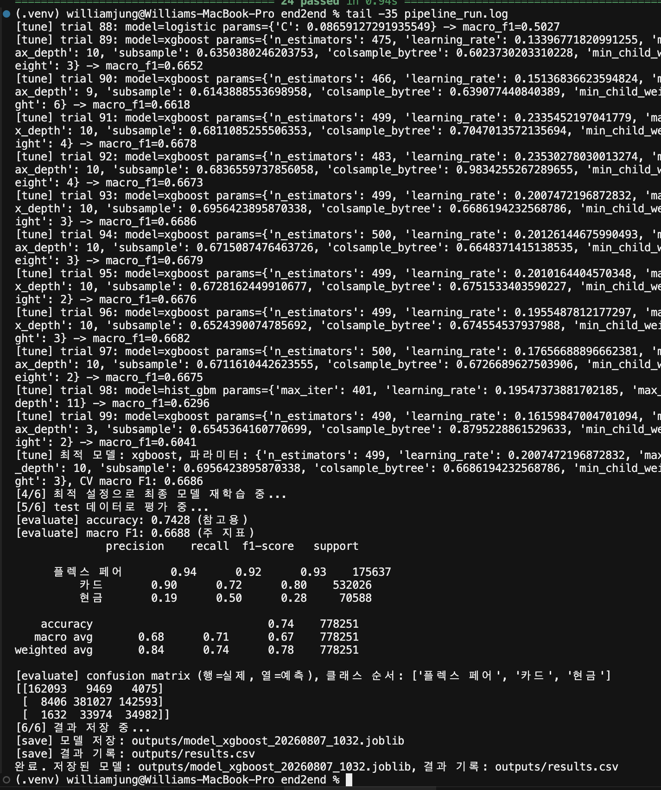

## 7. 실행 결과 화면

모든 화면은 `README.md`에 적힌 명령어를 그대로 실행한 결과다.

### 7.1 전체 파이프라인 실행 — `python main.py`

명령 한 번으로 통계 표 → Seaborn 차트 → Plotly HTML → 보고서까지 생성된다.

이어지는 화면에서 차트와 보고서가 생성되고, 마지막에 산출물 11개의 존재와 크기를 코드가 직접 확인한다.

> 중간의 `findfont: Failed to find font weight bold` 경고는 한글 폰트에 굵은 두께가 없어 기본 두께로 대체했다는 안내이며, 차트는 정상 생성된다(바로 아래 저장 로그로 확인).

### 7.2 테스트 — `pytest`

보고서 입력 계약(스키마·의미 검증)과 생성기에 대한 테스트 24개가 모두 통과한다.

### 7.3 모델 학습 결과 — `tail -35 pipeline_run.log`

2026-08-07 실행분(Optuna 100 trial, 약 40분)의 로그다. 최적 모델 선정 → 평가 → 저장까지의 실제 출력이며, 본 보고서 5장의 수치가 여기서 나왔다. 전체 재현은 `python main.py --full`.

## 8. 본인 의견

### 8.1 이번 분석에서 가장 중요한 발견

정확도 74.3%라는 숫자보다, **모델이 왜 틀리는지**를 특정한 것이 이번 작업의 핵심이었다. 혼동행렬을 보면 오분류의 대부분이 카드↔현금 사이에서 발생하고(카드 53만 건 중 14만 건 오판), 플렉스 페어는 F1 0.93으로 거의 완벽하게 구분된다. 이 패턴은 통계 검정과도 일치했다 — 수치형 피처 5개 모두 효과크기가 |d| ≤ 0.11로 미미했고, trip_distance는 389만 건 표본에서도 p = 0.588로 유의하지 않았다.

즉 **현재 피처는 "어떤 여행이었나"만 담고 있고, 카드/현금 선택은 "어떤 승객이었나"에 가깝다.** 모델을 더 튜닝하는 것으로는 넘을 수 없는 벽이며, 개선하려면 승차지역별 과거 현금결제 비율 같은 새 신호를 만들어야 한다.

### 8.2 p값을 믿지 않은 것

표본이 389만 건이면 어떤 검정이든 p < 0.001이 나온다. 실제로 t-test에서 4개 피처가 "통계적으로 유의"했지만, 효과크기를 함께 보니 전부 무시할 수준이었다. p값만 봤다면 "유의미한 피처를 찾았다"고 잘못 결론지었을 것이다. 표본이 클수록 p값이 아니라 효과크기를 봐야 한다는 것을 데이터로 확인했다.

### 8.3 개선이 필요한 부분 (한계)

- **데이터를 git에 포함시켰다.** 원칙대로라면 다운로드 스크립트로 대체해야 하지만(80MB), 제출 방식이 "GitHub에서 받아 압축"이라 데이터가 없으면 채점자가 실행할 수 없다. 재현성을 우선해 포함했고, 실무라면 `download.py`로 분리하는 것이 맞다.
- **파이프라인과 보고서의 연결이 아직 수동이다.** `pipeline.py`가 학습 결과를 `outputs/results.csv`에는 쓰지만 보고서 입력 JSON은 사람이 채운다. 여기에 손으로 숫자를 옮길 여지가 남아 있어, 평가 함수가 클래스별 지표를 반환해 JSON까지 직접 쓰도록 만드는 것이 다음 개선 과제다.
- **로그가 `print`다.** 요구사항의 "조용히 틀리느니 시끄럽게 멈춘다" 원칙에는 단계 태그가 붙은 현재 출력으로도 어느 정도 대응되지만, 레벨(INFO/WARNING/ERROR)과 시각이 남는 `logging`으로 옮기는 편이 낫다.
- **테스트가 보고서 모듈에만 있다.** 24개 테스트가 전부 `reporting/`을 대상으로 하고, 학습 파이프라인에는 없다. 다만 커버리지 숫자가 곧 품질은 아니다 — 커버리지는 "실행은 해봤다"는 뜻이지 "버그가 없다"는 증명이 아니다.

### 8.4 협업에서 배운 것

보고서 자동 생성 시스템(`reporting/`)이 팀원이 만든 계약(JSON 스키마) 위에 세워져 있어서, 각자 맡은 단계가 끝나면 JSON만 채우면 문서가 완성되는 구조였다. 실제로 형식이 어긋난 값을 넣었을 때 검증이 즉시 거부해준 덕분에 잘못된 숫자가 보고서에 실리는 일을 막을 수 있었다.

한편 테스트 하나가 특정 컴퓨터에서만 실패하는 문제도 겪었다. 날짜 형식 검사가 보조 라이브러리 유무에 따라 켜지고 꺼지면서 에러 메시지가 달라졌기 때문인데, "에러가 났는가"가 아니라 "에러 메시지가 무엇인가"까지 검사한 것이 원인이었다. 테스트는 동작을 검증해야지 특정 환경의 문구에 의존하면 안 된다는 것을 배웠다.
